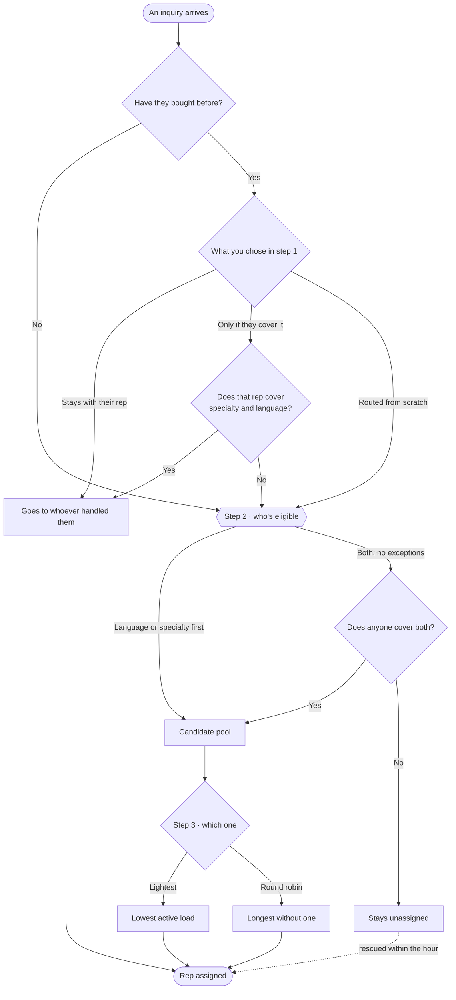

When a new inquiry comes in, somebody has to get it. **Automations → Routing** is where you decide who, in three steps that run in order.

<Frame>
  
  
</Frame>

The panel on the right isn't an illustration — it's the path your current settings produce. Change an option and the path redraws.

## 1. A returning customer writes again

Evaluated first, and if it applies, routing stops here.

- **Stays with their rep** — the new inquiry goes to whoever handled them before. It **ignores specialty**: whoever sold them a cruise gets their Disney inquiry too.
- **Only if they cover the topic** — stays with their rep only if that rep also covers the specialty and the language. Otherwise it goes to the pool.
- **Routed from scratch** — prior relationship doesn't count. They may end up with someone who doesn't know their history.

## 2. Who's eligible

How specialty and language combine to form the candidate pool.

| Option | What it does |
|---|---|
| **Language first** | Looks for a specialist who also speaks the language; if there's none, it prioritizes language |
| **Specialty first** | Same, the other way round |
| **Language only** | Ignores specialties. If nobody speaks the language, it goes to the whole team |
| **Specialty only** | Ignores language. If nobody covers the topic, it goes to the whole team |
| **Both, no exceptions** | Requires specialty *and* language. **If nobody qualifies, the inquiry stays unassigned** |

Each rep's specialties and languages are set in [Team](/team/managing).

## 3. Which one of them gets it

- **Whoever's lightest** — looks at active load, today's leads, and what they've let go cold. Open quotes count as load.
- **Round robin** — goes to whoever hasn't received one in longest. Doesn't look at load at all.

<Warning>
If an inquiry ends up unassigned, a process rescues it within the hour. It won't sit there forever — but it will sit there for up to an hour, which is a reason to be careful with "Both, no exceptions".
</Warning>
