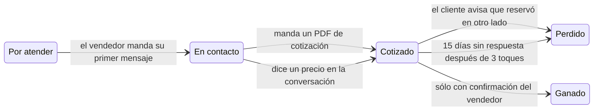

Un tablero sólo sirve si refleja la realidad, y eso no pasa si alguien tiene que acordarse de arrastrar tarjetas. Con los WhatsApp de tus vendedores conectados, Trama lee las conversaciones y mueve las tarjetas por su cuenta.

Disponible en los planes **Pro** y **Business**, porque necesita el [seguimiento de vendedores](/es/tracking/sales-reps).

## Qué mueve cada cosa

| Lo que pasa | Lo que hace Trama |
|---|---|
| El vendedor manda su primer mensaje al cliente | Mueve de **Por atender** a **En contacto** |
| El vendedor envía un PDF de cotización | Mueve de **En contacto** a **Cotizado** |
| El vendedor dice un precio en la conversación | Mueve de **En contacto** a **Cotizado** |
| El cliente dice que ya reservó en otro lado | Mueve a **Perdido**, con el motivo |
| Pasan 15 días sin respuesta después de tres toques | Mueve a **Perdido**, sin respuesta |

<Warning>
**Ganado nunca se mueve solo.** Cerrar una venta es la única transición que siempre pide confirmación de una persona: o la movés en el tablero, o se lo decís al Trama Agent por WhatsApp. Es a propósito — una venta mal marcada te ensucia todas las métricas de cierre.
</Warning>

## Sin los números conectados

En los planes gratuito y Starter, o si tus vendedores no conectaron su WhatsApp, las tarjetas las movés vos: arrastrándolas en el tablero, o diciéndoselo al Trama Agent.
