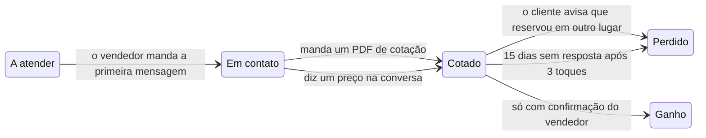

Um quadro só serve se refletir a realidade, e isso não acontece se alguém tiver que lembrar de arrastar cartões. Com os WhatsApp dos seus vendedores conectados, a Trama lê as conversas e move os cartões por conta própria.

Disponível nos planos pagos, a partir do **Starter**, porque precisa do [acompanhamento de vendedores](/pt-BR/tracking/sales-reps).

## O que move cada coisa

| O que acontece | O que a Trama faz |
|---|---|
| O vendedor manda a primeira mensagem ao cliente | Move de **A atender** para **Em contato** |
| O vendedor envia um PDF de cotação | Move de **Em contato** para **Cotado** |
| O vendedor diz um preço na conversa | Move de **Em contato** para **Cotado** |
| O cliente diz que já reservou em outro lugar | Move para **Perdido**, com o motivo |
| Passam 15 dias sem resposta após três toques | Move para **Perdido**, sem resposta |

<Warning>
**Ganho nunca se move sozinho.** Fechar uma venda é a única transição que sempre pede confirmação de uma pessoa: ou você a move no quadro, ou avisa o Trama Agent pelo WhatsApp. É de propósito — uma venda marcada errado suja todas as suas métricas de fechamento.
</Warning>

## Sem os números conectados

No plano gratuito, ou se os seus vendedores não conectaram o WhatsApp, os cartões você move: arrastando no quadro, ou avisando o Trama Agent.
