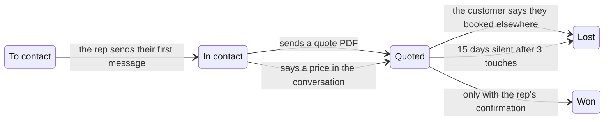

A board is only useful if it matches reality, and it won't if somebody has to remember to drag cards around. With your reps' WhatsApp numbers connected, Trama reads the conversations and moves the cards itself.

Available on the paid plans, from **Starter**, because it needs [sales rep tracking](/tracking/sales-reps).

## What moves what

| What happens | What Trama does |
|---|---|
| The rep sends their first message | Moves from **To contact** to **In contact** |
| The rep sends a quote PDF | Moves from **In contact** to **Quoted** |
| The rep says a price in the conversation | Moves from **In contact** to **Quoted** |
| The customer says they booked elsewhere | Moves to **Lost**, with the reason |
| 15 days pass with no reply after three touches | Moves to **Lost**, no reply |

<Warning>
**Won never moves on its own.** Closing a sale is the one transition that always needs a person to confirm: either you move it on the board, or you tell the Trama Agent over WhatsApp. That's deliberate — a wrongly marked sale poisons every closing metric you have.
</Warning>

## Without connected numbers

On the free plan, or if your reps haven't connected their WhatsApp, you move the cards yourself: by dragging them on the board, or by telling the Trama Agent.
